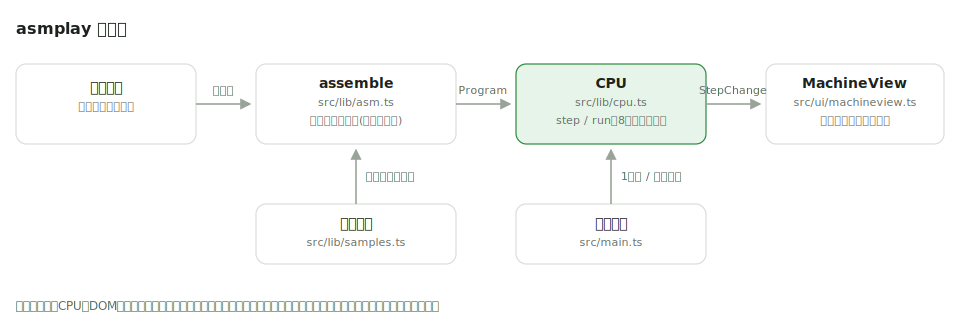

# asmplay

[](https://github.com/miruky/asmplay/actions/workflows/ci.yml)
[](https://github.com/miruky/asmplay/actions/workflows/deploy.yml)
[](https://www.typescriptlang.org/)
[](https://opensource.org/licenses/MIT)

**小さなアセンブリを書いて、レジスタ・メモリ・フラグが動く様子を一命令ずつ観察できる教育用CPUシミュレータ**

## 概要

asmplay は、ブラウザの中で動く架空の8ビットCPUである。8本のレジスタ(r0〜r7)、256バイトのメモリ、zero/ltの2つのフラグという見渡せる大きさの機械に、14種類の命令で書いたプログラムを流し込む。「1命令」ボタンで一歩ずつ進めると、いま実行された行がハイライトされ、書き換わったレジスタやメモリのセルが点滅する。行き過ぎたら「戻る」で一命令ずつ巻き戻せるので、状態がどの命令でどう動いたかを前後に往復しながら確かめられる。低水準の世界で何が起きているかを、説明ではなく目で追って覚えるための道具である。

メモリは番地つきのグリッドで、値の大きいセルほど淡く色づく。どの番地にデータが溜まっているかを俯瞰でき、`store` の結果がひと目で分かる。ループ・条件分岐・間接アドレッシング・足し算による掛け算など、概念ごとのサンプルを同梱している。エラーは最初の1個で止めず、行番号付きで全件並べる。

公開先: https://miruky.github.io/asmplay/

### なぜ作ったのか

高水準言語から入った人にとって「レジスタ」「番地」「フラグ」は言葉だけが先行しがちで、実機のx86やARMは観察するには複雑すぎる。教科書の架空CPUは紙の上で止まっている。手元のブラウザで書いてすぐ動き、状態の変化が全部見える大きさの機械があれば、CPUの気持ちを最短距離で体験できると考えた。

## アーキテクチャ



アセンブラ(`assemble`)とCPU(`step` / `run`)はDOMに依存しない純粋なロジックで、命令の意味論はすべてユニットテストで固定している。`step` は「どのレジスタ・メモリが変わったか」を返し、描画側はそれを受けて該当セルにだけ印を付ける。無限ループはステップ上限で打ち切られるため、ブラウザが固まることはない。

## 技術スタック

| カテゴリ             | 技術                                  |
| :------------------- | :------------------------------------ |
| 言語                 | TypeScript 5(strict、実行時依存なし)  |
| ビルド               | Vite 8                                |
| テスト               | Vitest 4 + happy-dom                  |
| リンタ・フォーマッタ | ESLint 9(typescript-eslint)+ Prettier |
| CI / 配信            | GitHub Actions + GitHub Pages         |

## 使い方

エディタにアセンブリを書き、「組み立てる」(Cmd+Enter または Ctrl+Enter)で命令列に変換してから、「1命令」または「実行」で進める。「戻る」で直前の状態へ巻き戻せる。エディタの外にフォーカスがあるときは矢印キー(→ で次へ、← で戻る)でも前後に動ける。書いたソースと実行速度はブラウザに保存され、次に開いたとき続きから始められる。

実行位置リストの行番号をクリックするとブレークポイントを置ける。「実行」は停止点の手前で自動的に止まるので、注目したい命令の直前まで一気に進めて、そこから1命令ずつ観察できる。「共有リンク」を押すと、いま書いているプログラムをURLに載せてクリップボードへコピーする。そのリンクを開けば同じプログラムが復元される。

### 命令セット

| 命令                                  | 意味                                          |
| :------------------------------------ | :-------------------------------------------- |
| `mov rd, rs` / `mov rd, imm`          | 代入(即値は0〜255、`0x`で16進)                |
| `add` `sub` `and` `or` `xor` `rd, rs` | 演算。結果は8ビットで巻き戻る                 |
| `addi rd, imm`                        | 即値の加算(負数も可)                          |
| `load rd, [番地]` / `load rd, [rs]`   | メモリから読む(直接・間接)                    |
| `store rs, [番地]` / `store rs, [rd]` | メモリへ書く                                  |
| `cmp ra, rb`                          | 比較。`zero`(等しい)と `lt`(左が小さい)を更新 |
| `jmp` / `jz` / `jnz` / `jlt` ラベル   | 無条件・条件ジャンプ                          |
| `out rs`                              | 出力欄に値を追加                              |
| `halt` / `nop`                        | 停止 / 何もしない                             |

ラベルは `名前:`、コメントは `;` から行末まで。1から5を数える最小のループはこう書く。

```
        mov  r0, 0
        mov  r1, 5
loop:   addi r0, 1
        out  r0
        cmp  r0, r1
        jnz  loop      ; r0 != 5 の間は繰り返す
        halt
```

実行すると出力欄に `1, 2, 3, 4, 5` が並び、メモリグリッドでは `store` した番地だけが色付きで残る。

割り切りも明記しておく。掛け算・割り算・スタック・割り込み・符号付き比較は持たない。フラグを更新するのは `cmp` だけで、演算命令はフラグに触れない。この単純化は実在のCPUとは異なるが、「比較してから跳ぶ」という制御の基本形を曖昧さなく見せるための選択である。

## プロジェクト構成

- `src/lib/` — DOM非依存のロジック。アセンブラ(`asm.ts`)、CPUの実行部(`cpu.ts`)、サンプルプログラム(`samples.ts`)、設定の保存(`storage.ts`)、URL共有(`share.ts`)
- `src/ui/` — DOMを扱う層。レジスタ・メモリ・実行位置・出力の描画(`machineview.ts`)
- `src/main.ts` — 画面の組み立てと実行制御
- `docs/` — 構成図
- `public/` — ロゴ・ファビコン
- `.github/workflows/` — CI(lint・テスト・ビルド)とGitHub Pagesへのデプロイ

## はじめ方

### 前提条件

Node.js 22以上。

### セットアップ

```bash
git clone https://github.com/miruky/asmplay.git
cd asmplay
npm ci
npm run dev
```

### テストの実行

```bash
npm test
```

### Lintの実行

```bash
npm run lint
```

### ビルドとデプロイ

```bash
npm run build
```

GitHub Pagesのようにサブパスへ配信する場合は `ASMPLAY_BASE=/asmplay/` を付けてビルドする。`main` へのpushで `deploy.yml` がビルドとPagesへの反映まで行う。

## 設計方針

- **観察できる大きさに絞る** — レジスタ8本・メモリ256バイト・命令14種は、全状態が1画面に収まり、何が起きても見落とさない上限として選んだ。機能を足すより「全部見える」ことを優先している。
- **意味論はテストで固定する** — 巻き戻り・フラグ更新・間接アドレッシング・ジャンプの各意味論と、全サンプルの実行結果(合計55、フィボナッチ数列の並びなど)をテストにしてあり、仕様書を兼ねる。
- **エラーは全件・行番号付き** — アセンブラは最初のエラーで止まらず最後まで読み、初学者が一度の修正で全部直せるようにした。
- **変化だけを光らせる** — `step` が返す差分情報で、書き換わったセルだけを点滅させる。`prefers-reduced-motion: reduce` では点滅を止める。
- **巻き戻せる実行** — 1命令ごとに状態の控えを積み、「戻る」で前の状態に復元する。観察しながら行きつ戻りつできることを、前進だけの速さより優先した。
- **サーバーを持たない共有** — プログラムはURLのハッシュに載せて配る。保存基盤を持たない代わり、リンク1本がそのまま再現可能なプログラムになる。

## ライセンス

[MIT](LICENSE)
